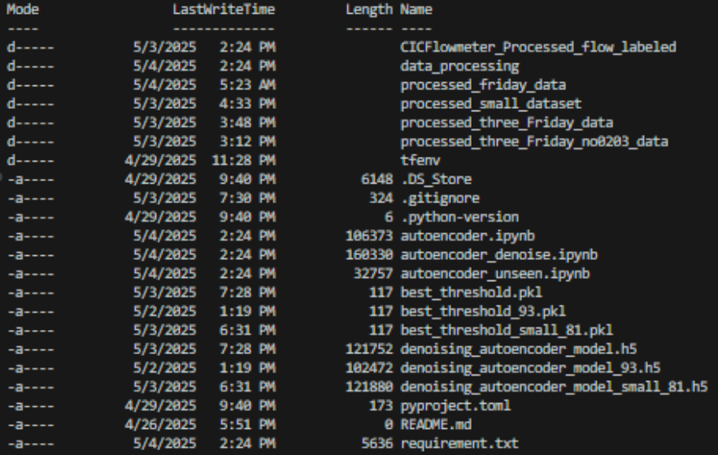
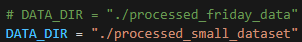

Readme.txt
==
CSEC-520 Cyber Analytics and Machine Learning Final Project

All the scripts in the assignment were written using Python and Jupyter Notebook.

Package Installation
--
Before running any of the script, begin by installing the necessary dependencies using the command:

    `pip install -r requirements.txt`
*Please note that `tensorflow` is not natively supported on Windows with Python versions past 3.09.

Usage 
==
The testing for this model has three disjoint parts: flow labeling, data processing, and the model testing.
1. **Flow Labeling**

    Begin by downloading the dataset from the [IDS 2018](https://www.kaggle.com/datasets/solarmainframe/ids-intrusion-csv/data/) repository. Then select the sample you would like to begin processing and run it through the `flow_labeling.py`, which will apply `CICFlowMeter-4.0` to label the PCAP data flow as benign or malicious and save the results in a folder.

2. **Data Processing**

    After flow labeling has completed, run `datasampling.py` which will split the data from flow labeling into training, validation, and testing sets by a `70:20:10` proportion. Data sampling for unseen data is also available by using `datasampling_thursday.py`.

3. **Model Testing** - Likely Starting Point

    Download Processed_Data.zip from the [shared drive](https://drive.google.com/drive/u/0/folders/1HGat7FXNTtUHuIHqL5R8b4iw9dDVIHCF).

    This zip file contains all processed training, validation, and testing datasets used in the project. After decompressing, your file structure should look like the following:

    

    Then, the model training process can be initiated using the autoencoder_denoise.ipynb Jupyter notebook.

    To switch between datasets, modify the DATA_DIR variable in the notebook accordingly. For example:

    

Flow Labeling: `flow_labeling.py`
--
This script assigns ground-truth labels to flows generated by CICFlowMeter, which does not produce labels by default. It cross-references each flow's timestamp, source and destination IPs with a predefined dictionary of attack windows, attacker IPs, and victim IPs derived from the CICIDS2018 documentation. The result is a labeled CSV file with each flow marked as Benign or with its corresponding attack type.

Data Sampling: `datasampling.py`
--
Original script designed to process and sample flow data from **Friday-02-16** and **Friday-02-03**. This dataset was used in the initial presentation. All training, validation, and testing sets are constructed from these two days. The script performs cleaning, benign flow undersampling, log transformation for skewed features, correlation-based feature dropping, and finally saves split datasets into CSV files.

Unseen Data Sampling: `datasampling_thursday.py`
--
Secondary script built from datasampling.py where the dropped features that were saved from datasampling.py are dropped to the new day's data. This new data is then saved to a file as only testing data.

Updated Sampling: `0216-0223-0203_sampling.py`
--
A modified version of the original script designed to evaluate model generalization. It uses benign flows from **Feb 16** and **Feb 23** for training and validation, while the **test set is exclusively taken from Feb 3**, which contains unseen attack samples. The goal is to simulate deployment on new traffic. Malicious flows in training are slightly upsampled to balance learning.

Updated Small: `0216-0223-0203_sampling_small_overlap.py`
--
A further variation designed to probe the model for overfitting. It includes small samples of benign data from **Feb 3** in the training set, while reserving different benign and malicious flows from **Feb 3** for final testing.

Original Encoder: `autoencoder.ipynb`
--
Original dense autoencoder that does not add noise before encoding data. Script loads preprocessed, pre-split data and handles any zero values. It then uses the keras dense autoencoder implementation to generate the autoencoder layers and trains the model using the training data generated previously. Finally, it runs all testing data through the autoencoder and checks against the labels for accuracy.

Denoise Encoder: `autoencoder_denoise.ipynb`
--
Autoencoder is similar to `autoencoder.ipynb` but includes noise addition to all model inputs. The added noise led to better generalization and forced the model to be less reliant on possible over-fit features. It forces the model to search for deep connections that will exist in unseen data flows.

Unseen Encoder Test: `autoencoder_unseen.ipynb`
--
Intended to run after `autoencoder_denoise.ipynb`. Uses the previously saved best threshold from the file `best_threshold.pkl` and loads the model from `denoising_autoencoder_model.h5`. This threshold and model are used to classify new test data from unseen samples. The unseen samples should already be labeled using `datasampling_thursday.py` as this script will read test samples from there. It handles zero entries, ensures that the feature size of testing data matches training data, classifies data based on the saved error threshold, and plots the results.